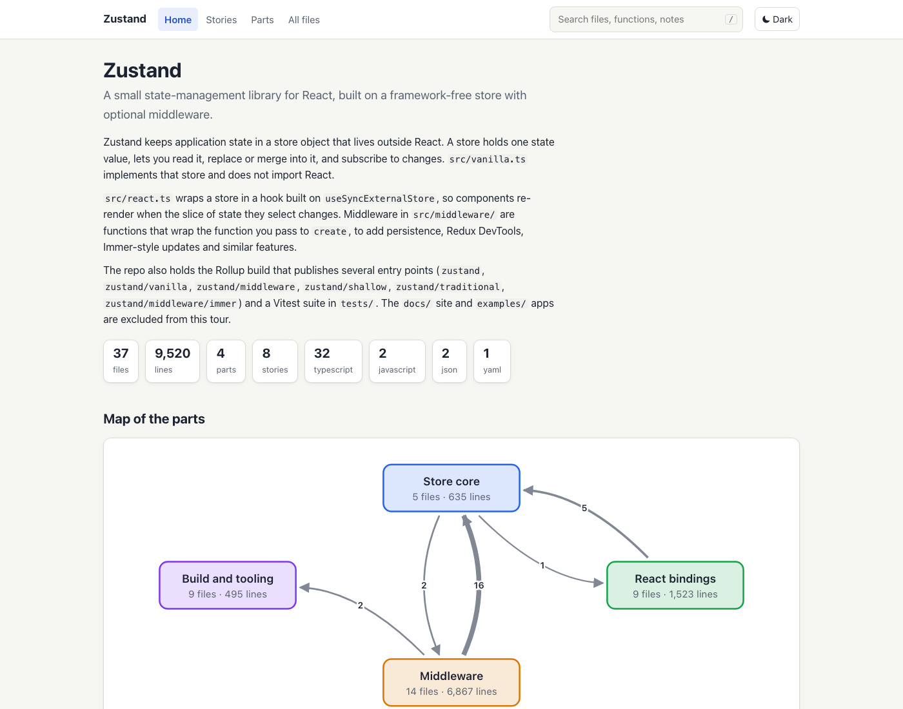
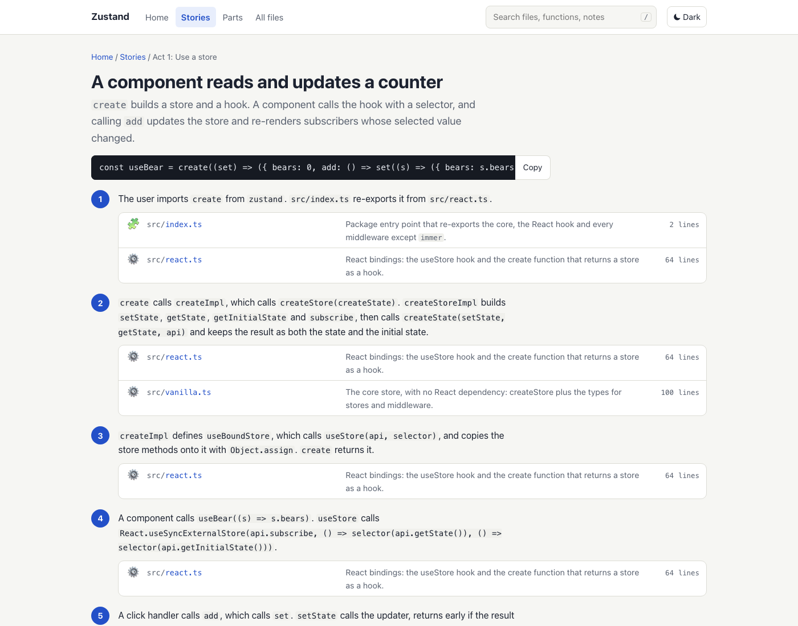
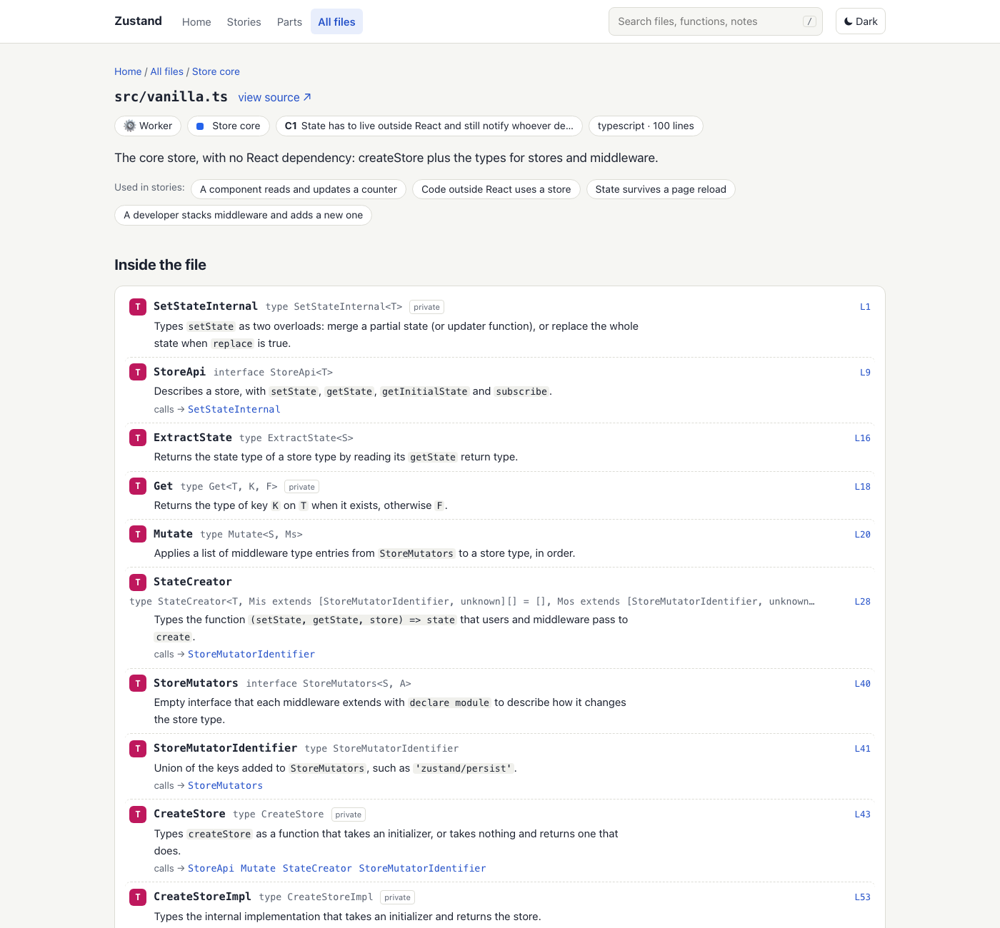

# RepoTour

Turns a code repository into one HTML file that a newcomer can read in an afternoon.

**Live demos** (made with the `/repotour` skill, zero warnings):
[zustand](https://tejeshkinariwala.github.io/repotour/examples/zustand/tour.html) (TypeScript) ·
[requests](https://tejeshkinariwala.github.io/repotour/examples/requests/tour.html) (Python) ·
[RepoTour itself](https://tejeshkinariwala.github.io/repotour/examples/repotour/tour.html).
The same files are in [`examples/`](examples/); download one and open it in a browser.



| A user story, step by step | Inside a file: one line per function |
|---|---|
|  |  |

## Why

Big codebases are hard to read. A file list does not say where to start, and a README rarely says what each file is for.

A RepoTour page gives you:

- **Parts, problems, files.** The repo is split into a few parts. Each part lists the problems it solves ("without this..." and "the fix") and the files that solve each one.
- **User stories.** Each story follows one use case through the code, step by step, with the command that starts it.
- **A role emoji per file**, so you can see at a glance which files start things, which check things, which store data.
- **A one-line note per function and class.**
- **Imports and used-by** for every file, so you can move in both directions.
- **A reading order.**

It is one self-contained file. It works offline and opens from disk.

## Quick start

Install the CLI (any one of these; Python 3.10 or newer):

```bash
uv tool install git+https://github.com/tejeshkinariwala/repotour
pipx install git+https://github.com/tejeshkinariwala/repotour
pip install git+https://github.com/tejeshkinariwala/repotour
```

Once RepoTour is on PyPI, `pipx install repotour` will also work.

Install the Claude Code skill, either as a plugin:

```
/plugin marketplace add tejeshkinariwala/repotour
/plugin install repotour@repotour
```

or by copying it into a project or your user folder:

```bash
repotour install-skill --project .   # into ./.claude/skills/repotour/
repotour install-skill --user        # into ~/.claude/skills/repotour/
# add --force to replace an existing install
```

Then, in Claude Code, from the repo you want to tour:

```
/repotour
```

(Installed as a plugin, the skill is namespaced: `/repotour:repotour`. Asking "make a tour of this repo" also triggers it.) You can pass a path: `/repotour path/to/repo`.

The skill writes `.repotour/tour.yaml` and `.repotour/notes.yaml`, builds the page and fixes warnings until there are none. Open `.repotour/tour.html`.

**Without AI.** `repotour build` works on any repo with no written content. It groups files by folder, assigns roles, and computes outlines, imports and used-by. You get no stories, problem descriptions or notes, and the page says how to add them.

```bash
repotour build --open
```

## How it works

Two layers.

**Engine** (this package, no AI, no network). Scans the repo, parses Python and JavaScript/TypeScript, assigns roles, computes imports, used-by and part-to-part dependencies, checks the written content, lists anything stale as a warning, and renders the HTML.

**Writer** (the `/repotour` skill). Runs inside your Claude Code session. It calls `repotour scan --json` to get the facts cheaply, reads the code it needs, and writes the human content: parts, problems, stories, guide and per-item notes. It then runs `repotour build` and fixes each warning.

The written content is two plain YAML files in `.repotour/`. You can edit them by hand. Schema: [skills/repotour/reference/tour-yaml.md](skills/repotour/reference/tour-yaml.md).

## Roles

Each file gets one role, by default from its path.

| Emoji | Role | Meaning |
|---|---|---|
| 🎬 | Conductor | Starts things and calls other files in order: entry points, CLIs, servers, scripts, build steps. |
| 📐 | Rulebook | Defines what things must look like: types, schemas, interfaces, base classes, constants, registries. Does little work itself. |
| ⚙️ | Worker | Does the actual work: the core logic, algorithms and transformations. |
| 🛡️ | Guard | Checks something and refuses or stops when it is wrong: validation, auth, permissions, limits. |
| 📦 | Storekeeper | Saves and loads data: databases, caches, files, queues, migrations. |
| 🔌 | Courier | Talks to the outside world: HTTP clients, API adapters, SDK wrappers, messaging. |
| 🔍 | Analyst | Measures and reports: metrics, logging, statistics, reports, charts. |
| 🖼️ | Face | What a user sees: UI components, pages, views, templates, styles. |
| 🗂️ | Settings | A file of settings or records that code reads. |
| 🧩 | Helper | Small shared utilities and package markers. |
| 🧪 | Test | Automated test that checks other files still behave as before. |

Override with `role_rules` in `tour.yaml`.

## CLI reference

All commands take an optional `PATH` (default `.`), the root of the repo.

| Command | What it does |
|---|---|
| `repotour build [PATH] [--out FILE] [--open] [--strict]` | Builds the tour. Default output: `PATH/.repotour/tour.html`. Prints warnings to stderr. With `--strict`, exits 1 if there are warnings. |
| `repotour scan [PATH] [--json] [--files-only]` | Prints the extracted facts: files, language, lines, header, role, outline, imports, libraries, used-by. `--json` is for the skill. |
| `repotour check [PATH]` | Validates like `build`, writes nothing, exits 1 on any warning. |
| `repotour init [PATH] [--force]` | Writes a starter `tour.yaml` (parts from top-level folders) and a `notes.yaml` skeleton. Will not overwrite without `--force`. |
| `repotour install-skill [--project PATH \| --user] [--force]` | Copies the skill into `.claude/skills/repotour/` of a project or your home folder. Refuses to overwrite an existing install without `--force`. |
| `repotour --version` | Prints the version. |

## Keeping the tour fresh

The tour goes stale when files are added, renamed or removed, or when functions change. `repotour check` reports each stale item as a warning and exits 1.

Pre-commit (`.git/hooks/pre-commit`):

```sh
#!/bin/sh
repotour check
```

GitHub Actions:

```yaml
name: Tour is current
on: [pull_request]
jobs:
  tour:
    runs-on: ubuntu-latest
    steps:
      - uses: actions/checkout@v4
      - uses: actions/setup-python@v5
        with:
          python-version: "3.12"
      - run: pip install git+https://github.com/tejeshkinariwala/repotour
      - run: repotour check
```

When it fails, run `/repotour` again. The skill updates the existing files and keeps ids and wording.

## Supported languages

| Language | What you get |
|---|---|
| Python (`.py`, `.pyi`) | Outline of functions, classes, methods and function tables; imports resolved to repo files; libraries. |
| JavaScript / TypeScript (`.js .jsx .mjs .cjs .ts .tsx .mts .cts`) | Outline of functions, classes, arrow functions, types and enums; imports resolved, including `tsconfig` paths. |
| Other text files (shell, YAML, TOML, JSON, SQL, ...) | Language, line count and header comment. |

Python files are parsed with the `ast` module of the Python that runs RepoTour. Syntax newer than that Python (for example `def f[T]` generics on Python 3.10 or 3.11) makes the file show without an outline, with a warning. The JavaScript/TypeScript analyzer is a lightweight parser, not a compiler, so unusual code (for example a decorator and a method on the same line) can be missed; please open an issue with a snippet.

To add a language, write an analyzer in `src/repotour/analyzers/` and register its suffixes. See [CONTRIBUTING.md](CONTRIBUTING.md).

## Privacy

The engine runs offline. It makes no network requests and calls no AI service. The HTML page loads nothing from outside.

The skill runs inside your own Claude Code session, so the code it reads goes wherever your Claude Code session already sends it. RepoTour adds no server of its own.

## Contributing

See [CONTRIBUTING.md](CONTRIBUTING.md). The specification is [docs/SPEC.md](docs/SPEC.md).

## License

MIT. See [LICENSE](LICENSE).
